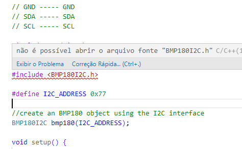

## Como configurar o projeto - Método simples

Abra o Terminal do seu VSCode e digite:
```
./config
```
O scritp irá configurar tudo

Caso o Arduino apresente algum problema, use o método manual

## Como instalar o Arduino - Método manual

1. Instale o Chocolatey

Execute o Powershell
```powershell
Set-ExecutionPolicy Bypass -Scope Process -Force; [System.Net.ServicePointManager]::SecurityProtocol = [System.Net.ServicePointManager]::SecurityProtocol -bor 3072; iex ((New-Object System.Net.WebClient).DownloadString('https://community.chocolatey.org/install.ps1'))
```

2. Instale o MINGW via Chocolate como Administrador
```chocolatey
cinst mingw
```

Teste se as bibliotecas C foram instaladas:
```
gcc --version
g++ --version
gdb --version
```

Caso tudo esteja OK, o resultado deve ser este:
```log
PS > gcc --version
gcc.exe (MinGW-W64 x86_64-ucrt-posix-seh, built by Brecht Sanders) 12.2.0
Copyright (C) 2022 Free Software Foundation, Inc.
This is free software; see the source for copying conditions.  There is NO
warranty; not even for MERCHANTABILITY or FITNESS FOR A PARTICULAR PURPOSE.

PS > g++ --version
g++.exe (MinGW-W64 x86_64-ucrt-posix-seh, built by Brecht Sanders) 12.2.0
Copyright (C) 2022 Free Software Foundation, Inc.
This is free software; see the source for copying conditions.  There is NO
warranty; not even for MERCHANTABILITY or FITNESS FOR A PARTICULAR PURPOSE.

PS > gdb --version
GNU gdb (GDB for MinGW-W64 x86_64, built by Brecht Sanders) 12.1
Copyright (C) 2022 Free Software Foundation, Inc.
License GPLv3+: GNU GPL version 3 or later <http://gnu.org/licenses/gpl.html>
This is free software: you are free to change and redistribute it.
There is NO WARRANTY, to the extent permitted by law.
```

3. Instale o Arduino IDE 1.x

> ⚠️ NÃO INSTALE O ARDUINO IDE 2.0, ELE É PROBLEMÁTICO ⚠️

Link:
https://downloads.arduino.cc/arduino-1.8.19-windows.exe


4. [Recomendado] Instale o VSCode

https://code.visualstudio.com/download

5. No VSCode instale a extensão **Arduino**, da Microsoft

Link da extensão: https://marketplace.visualstudio.com/items?itemName=vsciot-vscode.vscode-arduino

6. Configure as bibliotecas

Gere os arquivos do vscode para que o Arduino detecte sua pasta:

arduino.json:
`F1` + "arduino initialize"

c_cpp_properties.json

Vá numa linha com erro e clique em `Correção Rápida... (Ctrl+.)`



Isto criará o arquivo c_cpp_properties